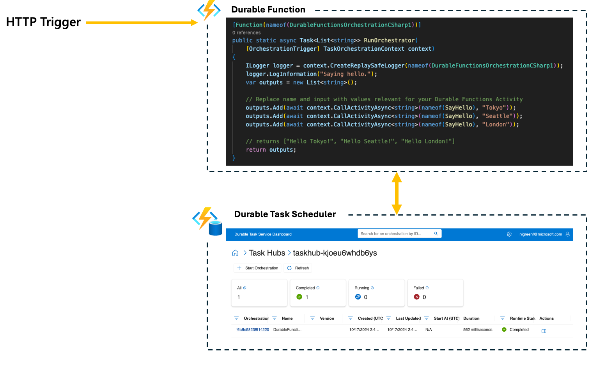
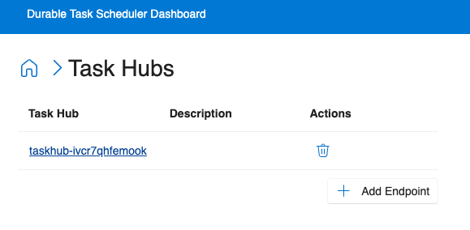

<!--
---
description: This repository contains a Azure Functions HTTP trigger quickstart written in C# and deployed to Azure Functions Elastic Premium using the Azure Developer CLI (AZD). This sample uses managed identity and a virtual network to insure it is secure by default.
page_type: sample
products:
- azure-functions
- durable-functions
- dts
- azure
- entra-id
urlFragment: starter-http-trigger-csharp
languages:
- csharp
- bicep
- azdeveloper
---
-->

## Durable Task Scheduler: A Quickstart Video
Click the image below to watch the video on YouTube.

<a href="https://youtu.be/8Ot13RgT2oI"></a>

Let's begin working with Durable Functions using the new Durable Task Scheduler (private preview) backend provider.

In this quickstart, the [provided sample](https://github.com/Azure/Azure-Functions-Durable-Task-Scheduler-Private-Preview/tree/main/quickstarts/HelloCities) uses the [official Durable Functions "hello cities" quickstart](https://learn.microsoft.com/azure/azure-functions/durable/durable-functions-isolated-create-first-csharp?pivots=code-editor-vscode). The sample schedules orchestrations that include 3 activities via an HTTP trigger.

This quickstart showcases the necessary configuration for using Durable Task Scheduler as the backend provider for your Durable Function app. The template defaults to **Elastic Premium EP1 sku plan on Linux**.


## Prerequisites

- [Create an active Azure subscription](https://learn.microsoft.com/azure/guides/developer/azure-developer-guide#understanding-accounts-subscriptions-and-billing).
- [Azure Developer CLI (`azd`)](https://aka.ms/azd) installed


## Log into the Azure CLI

In a terminal window, run the following command to log into the Azure CLI.

```azurecli
az login
```

## Clone the project

1. Clone this repo to your developer machine:

    ```shell
    git clone https://github.com/Azure/Azure-Functions-Durable-Task-Scheduler-Private-Preview.git
    ```

1. Navigate to the `hello cities` source code directory:

    ```shell
    cd Azure-Functions-Durable-Task-Scheduler-Private-Preview/quickstarts/HelloCities/http/
    ```

1. Open the Application in VS Code:

    ```shell
    code .
    ```

## Deploy the app to Azure

Use the [Azure Developer CLI (`azd`)](https://aka.ms/azd) to easily deploy the app.

> **Note:** If you open this repo in GitHub CodeSpaces, the `azd` tooling is already installed.

1. Find the regions where the Durable Task Scheduler is available:
   ```bash
  az provider show --namespace Microsoft.DurableTask --query "resourceTypes[?resourceType=='schedulers'].locations | [0]" --out table
  ```

1. Navigate to `quickstarts/hello_cities` and run the following command to provision:

    ```bash
    azd up
    ```

1. When prompted, provide:
   - A name for your [Azure Developer CLI environment](https://learn.microsoft.com/azure/developer/azure-developer-cli/faq#what-is-an-environment-name).
   - The Azure subscription you'd like to use.
   - The Azure location to use. This location is related to the location in which you created the resource group, scheduler, and task hub.

    Once the azd up command finishes, the app will have successfully provisioned and deployed.

    > **Note:**
    > If the deployment finishes with a `"Run-From-Zip is set to a remote URL using WEBSITE_RUN_FROM_PACKAGE or WEBSITE_USE_ZIP app setting` error, you can ignore it.
    >
    > If you get the error `The request may be blocked by network rules of storage account` when uploading _functions.zip_ to blob storage, rerun the upload command. There's a command in the deploy script that allow-lists you computer's IP address in the storage account firewall. However, more time than specified might be needed for the allowlist to take into effect.  

1. After the deployment is complete, go to the portal and locate the provisioned resource group (`rg-ENVIRONMENT-NAME`). Click on the resource group and copy the name of the function app that was created inside it.

1. Run the following command, replacing the placeholder with the name of your app:

    ```bash
    func azure functionapp list-functions <FUNCTION_APP_NAME> --show-keys
    ```

    *Expected output*
    ```
    SayHello - [activityTrigger]

    DurableFunctionsOrchestrationCSharp1 - [orchestrationTrigger]

    DurableFunctionsOrchestrationCSharp1_HttpStart - [httpTrigger]
        Invoke url: https://my-func-app.azurewebsites.net/api/durablefunctionsorchestrationcsharp1_httpstart

    ``` 
1. Navigate to the `DurableFunctionsOrchestrationsCSharp1_HttpStart` URL to start an order processing orchestration instance. Use the durable task scheduler dashboard to check orchestration details.

## Access dashboard after deployment

You can access the dashboard by going to **https://dashboard.durabletask.io/** and [registering a task hub endpoint](#scheduler-registration) or by following steps below to get the dashboard URL on Azure portal. 

1. Navigate to the `rg-<YOUR_AZD_ENVIRONMENT_NAME>` overview page on Azure portal.

1. Select the `dts-<randomGUID>` resource:
    

1. When on the resource overview page, select the task hub:
    

1. Find the dashboard url in the top "Essentials" section:
    

1. Browse orchestration state and history from within the TaskHub:


## Identity-based authentication

The durable task scheduler supports identity-based authentication only. This sample sets up the authentication through specifications in bicep files. If you're configuring identity-based access yourself, refer to [documentation on Microsoft Learn](https://learn.microsoft.com/azure/azure-functions/durable/durable-task-scheduler/develop-with-durable-task-scheduler?tabs=function-app-integrated-creation&pivots=az-cli#configure-identity-based-authentication-for-app-to-access-durable-task-scheduler). 

## Clean up resources

Delete the resource group `rg-ENVIRONMENT-NAME` to deprovision all resources created:

```bash
az group delete --name rg-ENVIRONMENT-NAME
```

## Scheduler registration

1. Navigate to [https://dashboard.durabletask.io](https://dashboard.durabletask.io/) and sign in using your Microsoft Entra ID account.

1. Once successfully authenticated, follow these steps to add the connection to the Durable Task Scheduler:

    

- Add your Subscription ID in the Subscription input field.
- Enter the Scheduler Resource Name in the Scheduler input field.
- Provide the Scheduler Endpoint in the Scheduler Endpoint input field. You can use the Azure CLI Durable Task Extension to retrieve the endpoint:

```bash
% az durabletask scheduler list -g "RESOURCE-GROUP-NAME"
```

*Output*
```json
[
  {
    "id": "/subscriptions/SUBSCRIPTION-ID/resourceGroups/RESOURCE-GROUP/providers/Microsoft.DurableTask/schedulers/SCHEDULER-NAME",
    "location": "westus2",
    "name": "SCHEDULER-NAME",
    "properties": {
      "endpoint": "https://SCHEDULER-NAME.westus2.durabletask.io",
      "ipAllowlist": [
        "0.0.0.0/0"
      ],
      "provisioningState": "Succeeded",
      "sku": {
        "capacity": 1,
        "name": "Dedicated",
        "redundancyState": "None"
      }
    },
    "resourceGroup": "RESOURCE-GROUP",
    "systemData": {
      "createdAt": "2025-01-14T19:32:34Z",
      "createdBy": "email@microsoft.com",
      "createdByType": "User",
      "lastModifiedAt": "2025-01-14T19:32:34Z",
      "lastModifiedBy": "email@microsoft.com",
      "lastModifiedByType": "User"
    },
    "tags": {
      "azd-env-name": "RESOURCE-GROUP-NAME"
    }
  }
]
```

- Add the name of the TaskHub. Use the following CLI command to locate the TaskHub name 

```bash
az durabletask taskhub list -s "SCHEDULER-NAME" -g "RESOURCE-GROUP"
```

*Output*
```json
[
  {
    "id": "/subscriptions/SUBSCRIPTION-IDresourceGroups/RESOURCE-GROUP/providers/Microsoft.DurableTask/schedulers/SCHEDULER-NAME/taskHubs/TASKHUB-NAME",
    "name": "TASKHUB-NAME",
    "properties": {
      "dashboardUrl": "https://dashboard.durabletask.io/subscriptions/SUBSCRIPTION-ID/schedulers/SCHEDULER-NAME/taskhubs/TASKHUB-NAME?endpoint=https%3a%2f%2fSCHEDULER-NAME.westus2.durabletask.io",
      "provisioningState": "Succeeded"
    },
    "resourceGroup": "RESOURCE-GROUP",
    "systemData": {
      "createdAt": "2025-01-14T19:49:11Z",
      "createdBy": "email@microsoft.com",
      "createdByType": "User",
      "lastModifiedAt": "2025-01-14T19:49:11Z",
      "lastModifiedBy": "email@microsoft.com",
      "lastModifiedByType": "User"
    }
  }
]
```

- Click "Add Endpoint".

    

3. Once the connection has been successfully added, you will be able to navigate to the TaskHub Overview page, where you can see the status of the orchestrations within that TaskHub.

    

## Next steps

Learn more about:
- [Durable Functions](https://learn.microsoft.com/azure/azure-functions/durable/durable-functions-overview)
- [Durable Task Scheduler](https://learn.microsoft.com/azure/azure-functions/durable/durable-task-scheduler/durable-task-scheduler)