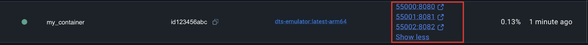
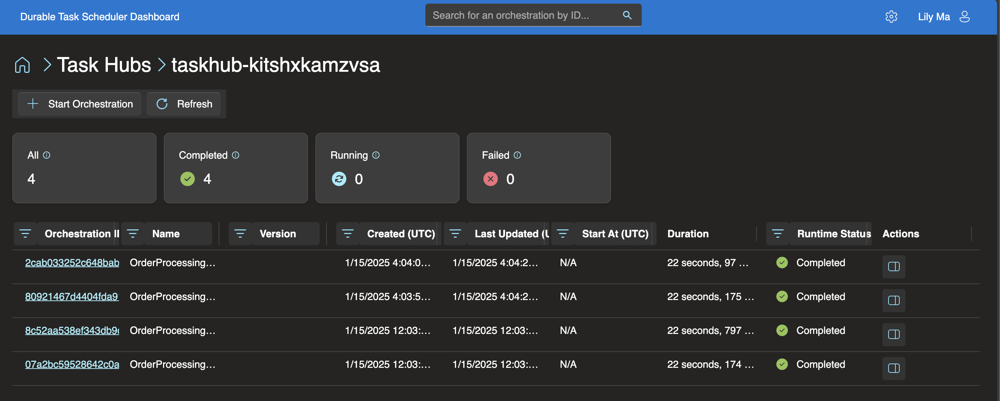
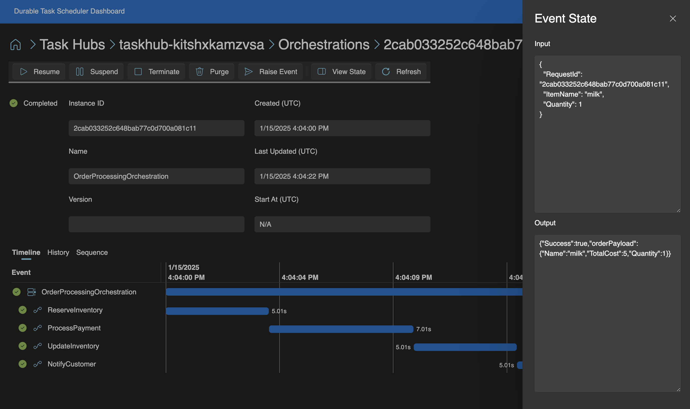
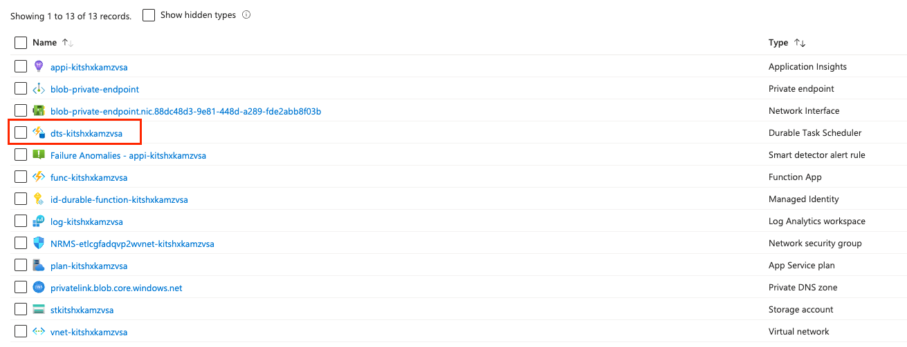
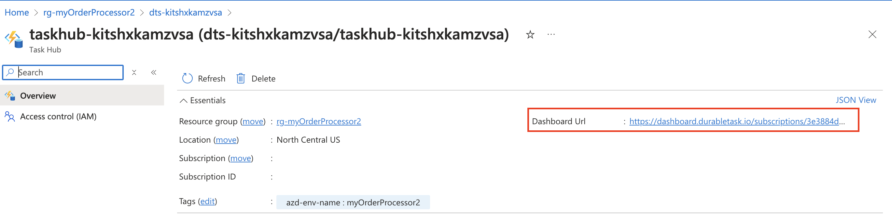

<!--
---
description: This E2E sample show a simplified order processing workflow in .NET (isolated).
page_type: sample
products:
- azure-functions
- durable-functions
- dts
- azure
- entra-id
urlFragment: order-processing-csharp
languages:
- csharp
---
-->
## Order processing workflow (.NET isolated)

This sample showcases a order processing workflow implemented using Durable Functions in .NET (isolated) and the Durable Task Scheduler as the storage backend provider. 

You'll need: 
- [Docker](https://docs.docker.com/engine/install/) installed to run the durable task scheduler emulator.
- [Azurite](https://review.learn.microsoft.com/azure/storage/common/storage-use-azurite#run-azurite) installed.
- An [HTTP test tool](https://review.learn.microsoft.com/azure/azure-functions/functions-develop-local#http-test-tools) that keeps your data secure.

## Examine the app (optional)
The `OrderProcessingOrchestration` is started by an http trigger, which starts a workflow that simulates making a purchase on an e-commerce website. The orchestration consists of the following activity functions, which are found in the **Activities** directory:

* `ReserveInventory`: This activity checks to see if there's enough inventory for the purchase
* `UpdateInventory`: This activity updates the inventory count 
* `NotifyCustomer`: This activity sends a message to the purchaser when the purchase is successful or not successful because of insufficient inventory or failed payment processing. 
* `ProcessPayment`: This activity processes and authorizes the payment for the purchase

In *host.json*, we configure Durable Functions to use the Durable Task Scheduler:

```json
"durableTask": {
      "storageProvider": {
        "type": "azureManaged",
        "connectionStringName": "DTS_CONNECTION_STRING"
      },
      "hubName": "%TASKHUB_NAME%"
}
```

## Running app locally

To run the app:
1. Add a *local.settings.json* file in the project root directory with the following content:
    ```json
    {
        "IsEncrypted": false,
        "Values": {
            "FUNCTIONS_WORKER_RUNTIME": "dotnet-isolated",
            "AzureWebJobsStorage": "UseDevelopmentStorage=true",
            "DTS_CONNECTION_STRING": "Endpoint=http://localhost:{port number};Authentication=None",
            "TASKHUB_NAME": "default"
        }
    }
    ```

    Follow the next step to get the port number. 

1. Pull the durable task scheduler emulator image from Docker and run it:

    ```bash
    docker pull mcr.microsoft.com/dts/dts-emulator:latest
    ```

    ```bash
    docker run -itP mcr.microsoft.com/dts/dts-emulator:latest
    ```

    There are several ports exposed and mapped dynamically by default. The port that maps to `8080` is the one to use in the connection string.

    

    In the example above, port `55000` is mapped to the `8080` endpoint, so the connection string should be `Endpoint=http://localhost:55000;Authentication=None`

1. Start the Azure Storage emulator [Azurite](https://learn.microsoft.com/azure/storage/common/storage-use-azurite) in the project root directory. (This is needed for by the Function app.)

     ```bash
    azurite start
    ```

1. Start the app in the project root directory.

     ```bash
    func start
    ```

    *Expected output*
    ```
    NotifyCustomer - [activityTrigger]

    OrderProcessingOrchestration - [orchestrationTrigger]

    OrderProcessingOrchestration_HttpStart - [httpTrigger]
        Invoke url: https://my-func-app.azurewebsites.net/api/orderprocessingorchestration_httpstart

    ProcessPayment - [activityTrigger]

    ReserveInventory - [activityTrigger]

    UpdateInventory - [activityTrigger]
    ``` 

    > **Note:**
    > If you encounter the error: `Can't determine Project to build. Expected 1 .csproj or .fsproj but found 2`:
    > 
    > Delete the bin and obj directories under OrderProcessor.
    > Try running `func start` again.

1. Navigate to the `OrderProcessingOrchestration_HttpStart` URL. This will start an order processing orchestration instance. 

1. Check the status of the orchestration by using the durable task scheduler monitoring dashboard. 

### Durable task scheduler dashboard 
The dashboard comes out-of-the-box and is also available when using the emulator. Click on the `8082` port on Docker desktop, and then click on the task hub named  `default` to see the dashboard.



The dashboard gives a summary of all the orchestration instances run or running against that task hub: 



Drill into an orchestration instance to see what activities were executed, duration, payload information, etc.:


The example below shows the input and output of the *ReserveInventory* activity:



## Deploy the app to Azure
Use the [Azure Developer CLI (`azd`)](https://aka.ms/azd) to easily deploy the app. 

1. In the root of the project, run the following command to provision and deploy the app:

    ```bash
    azd up
    ```

1. When prompted, provide:
   - A name for your [Azure Developer CLI environment](https://learn.microsoft.com/en-us/azure/developer/azure-developer-cli/faq#what-is-an-environment-name).
   - The Azure subscription you'd like to use.
   - Pick one of the Azure locations that have support for DTS.

    Once the azd up command finishes, the app will have successfully provisioned and deployed. The deployment finishes with a `"Run-From-Zip is set to a remote URL using WEBSITE_RUN_FROM_PACKAGE or WEBSITE_USE_ZIP app setting` error. You can ignore this.

1. After the deployment is complete, go to the portal and locate the provisioned resource group (`rg-ENVIRONMENT-NAME`). Click on the resource group and copy the name of the function app that was created inside it.

1. Run the following command, replacing the placeholder with the name of your app:

    ```bash
    func azure functionapp list-functions <FUNCTION_APP_NAME> --show-keys
    ```

    *Expected output*
    ```
    NotifyCustomer - [activityTrigger]

    OrderProcessingOrchestration - [orchestrationTrigger]

    OrderProcessingOrchestration_HttpStart - [httpTrigger]
        Invoke url: https://my-func-app.azurewebsites.net/api/orderprocessingorchestration_httpstart

    ProcessPayment - [activityTrigger]

    ReserveInventory - [activityTrigger]

    UpdateInventory - [activityTrigger]
    ``` 
1. Navigate to the `OrderProcessingOrchestration_HttpStart` URL to start an order processing orchestration instance. Use the durable task scheduler dashboard to check orchestration details. 

## Access dashboard after deployment
You can access the dashboard by going to **https://dashboard.durabletask.io/** and registering a task hub endpoint or by following steps below to get the dashboard URL on Azure portal. 

1. Navigate to the `rg-<YOUR_AZD_ENVIRONMENT_NAME>` overview page on Azure portal.

1. Select the `dts-<randomGUID>` resource:


1. When on the resource overview page, select the task hub:


1. Find the dashboard url in the top "Essentials" section: 


## Next steps

Learn more about:
- [Durable Functions](https://learn.microsoft.com/azure/azure-functions/durable/durable-functions-overview)
- [Durable Task Scheduler](https://learn.microsoft.com/azure/azure-functions/durable/durable-task-scheduler/durable-task-scheduler)
